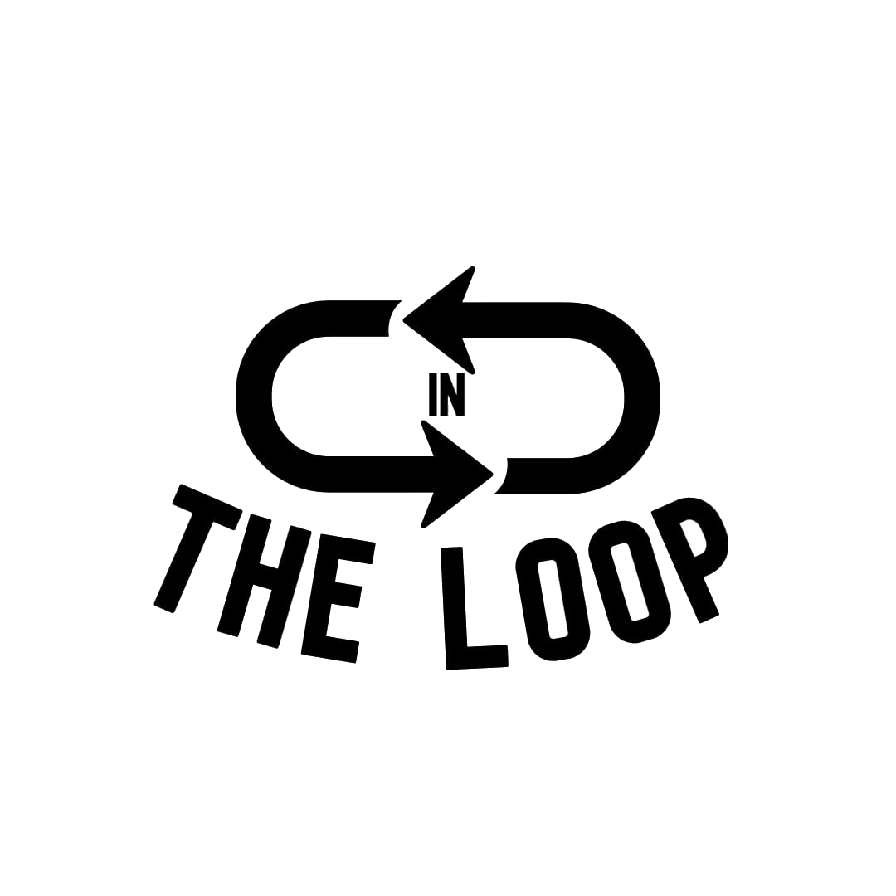

<table border="0">
<tr>
<td>

# In The Loop
<i> A Telegram-based newsletter bot to stay connected with friends, inspired by [Letterloop](https://www.letterloop.co/)</i>

</td>

<td>



</td>
</tr>
</table>

## About this project

For a couple of months, Letterloop allowed me to stay connected with my friends and be in the know of what they were up too at different stages of our lives. We received monthly promptings to update on our lives on a website, before our responses get collated and sent back to us as newsletters showcasing our month for us to keep and enjoy.

## My issue

Since it was a lighthearted activity and not something we were extremely invested in, it was hard for us to continue with the monthly subscription to be able to use the service.

Having some time on my hands, I decided to take that opportunity to recreate my version of Letterloop, with modifications such as allowing users to subscribe to it through a Telegram group, rather than submitting their emails. It is a small scale project and not designed to handle high volumes of traffic as compared to the original Letterloop. 

## Project structure

### Telegram interface

A Python-based telegram bot is created and dockerized, it's main functionality is to allow users in a group chat to subscribe to the service, before sending them custom links to key in their responses monthly. 

Dockerizing the Python script allows greater flexibility and scalability when I host this job on my home server with other running jobs.

### Web-hosting

I hosted a web application on the AWS EC2 free instance, it is a ```t2.micro``` instance, but functions like a charm for the scale of my project.

I followed this [guide](https://medium.com/@matlabinfotech12/deploy-nodejs-application-on-aws-4f142247bd55) in order to deploy my NodeJS application on a free EC2 instance on AWS.

I decided to create the web application using NodeJS, which was something I was not familiar with and was willing to learn. So far, it has brought me me great pain debugging.

## Want to try it?

I released the code here for learning purposes and for my personal reference in the future. If you would like to try it, you can check it out here:
https://t.me/in_the_loop_bot

After bringing up the start menu in the group and subscribing to the newsletter, every user should privately message the bot. This is because the bot is unable to initiate a conversation with a user as part of Telegram's security features.

This project is just a POC and is not responsible for any tamperment or loss of data. Happy looping!

